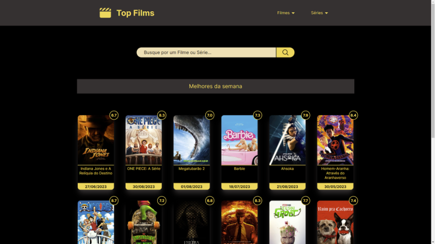

## Top Films

<br />

Buscador de filmes e séries feito com **NextJS** e a API da **TMDB**.

Apenas para estudos e adquirir experiência na prática.

Acesse o projeto aqui: [Top Films](https://top-films-gio98sp.vercel.app/)

## Executando o projeto

Para clonar e rodar o projeto siga os passos abaixo:

- Passo 1 - Clone o repositório em uma pasta executando o comando:

```bash
git clone https://github.com/gio98sp/top_films.git
```

- Passo 2 - Instale as dependências:

```bash
npm i
```

- Passo 3 - Crie uma conta na [TMDB](https://www.themoviedb.org) e adquira seu token na página do seu perfil e adicione no arquivo .env.example


- Passo 4 - Execute no modo de desenvolvimento:

```bash
npm run dev
```